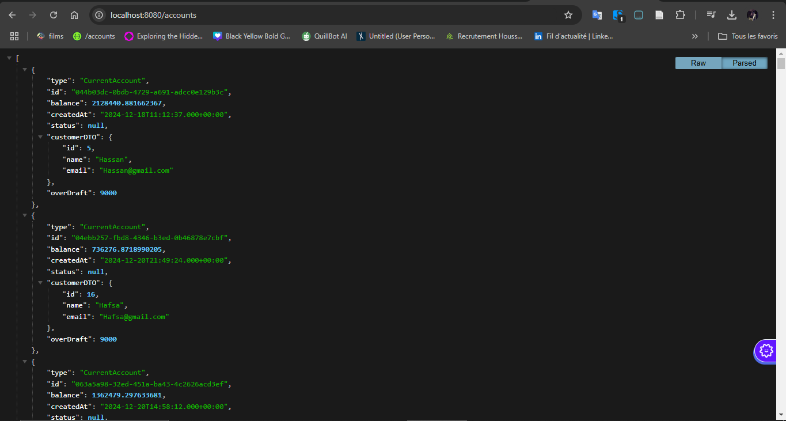

# Gestion de Comptes Bancaires

Ce projet est une application de gestion de comptes bancaires. Il permet de gérer des clients et leurs comptes, ainsi que d'effectuer des opérations de type **DEBIT** ou **CREDIT** sur ces comptes. Les comptes peuvent être de deux types : **Comptes courants** et **Comptes épargnes**.

## Fonctionnalités

1. Gestion des clients et des comptes.
2. Historique des opérations (DEBIT, CREDIT) pour chaque compte.
3. Exposition d'API REST pour interagir avec l'application.
4. Documentation des API avec Swagger.

---

## Structure du Projet

### Partie 1 : Backend

Le backend est développé avec **Spring Boot** et se compose des éléments suivants :

### Étapes de développement :

1. **Créer un projet Spring Boot**
   - Initialisez un projet Spring Boot à l'aide de Spring Initializr.

2. **Créer les entités JPA** :
   - `Customer` : représente un client.
   - `BankAccount` : entité de base pour les comptes bancaires.
   - `SavingAccount` : hérite de `BankAccount`, représente un compte épargne.
   - `CurrentAccount` : hérite de `BankAccount`, représente un compte courant.
   - `AccountOperation` : représente une opération bancaire (DEBIT ou CREDIT).

3. **Créer les interfaces JPA Repository**
   - Utilisez Spring Data JPA pour gérer les interactions avec la base de données.
   - <h1>Base de donnees H2</h1>

   - <h2>Strategie SINGLE TABLE</h2>

   - <h3>Tables créés</h3>

   - 

   - <h3>Table Customer</h3>

   - 

   - <h3>Table Bank_Account</h3>

   - 

   - <h3>Table Account_Operation</h3>

   - 

   - <h2>Strategie TABLE PER CLASS</h2>

   - <h3>Tables créés</h3>

   - 

   - <h3>Table Current Account</h3>

   - 

   - <h3>Table Saving Account</h3>

   - 

   - <h2>Strategie JOINED</h2>

   - <h3>Tables créés</h3>

   - 

   - <h3>Table Bank_Account</h3>

   - 

   - <h3>Table Current Account</h3>

   - 

   - <h3>Table Saving Account</h3>

   - 

   - <h1>Base de donnees MySql</h1>

   - <h2>Affichage des operations</h2>

   - 
   
   - <h2>Consultation de la liste des comptes</h2>
   - 
   - <h2>Consultation d'un compte</h2>
   - 
   - <h2>Consultation des opérations d'un compte</h2>
   - 
   - <h2>Pagination</h2>
   - 

4. **Tester la couche DAO**
   - Vérifiez les fonctionnalités de base (CRUD) sur les entités à l'aide de tests unitaires ou d'intégration.

5. **Couche Service et DTOs**
   - Implémentez la logique métier dans la couche service.
   - Créez des DTOs pour transférer les données entre les couches.

6. **RestController**
   - Exposez les services via des contrôleurs RESTful.

7. **Tester les web services RESTful**
   - Utilisez des outils comme Postman ou Swagger UI pour tester les API REST.
   - 

### Documentation des API avec Swagger

Pour intégrer Swagger dans le projet Spring Boot (version 3), ajoutez la dépendance suivante dans le fichier `pom.xml` :

```xml
<dependency> 
   <groupId>org.springdoc</groupId> 
   <artifactId>springdoc-openapi-starter-webmvc-ui</artifactId> 
   <version>2.1.0</version> 
</dependency>
```
---

## Pré-requis

- Java 17+
- Maven ou Gradle
- Spring Boot 3.x
- IDE (IntelliJ IDEA, Eclipse, VSCode, etc.)
- Base de données (H2, MySQL, PostgreSQL, etc.)

---

## Installation et Exécution

1. Clonez le dépôt :
   ```bash
   git clone https://github.com/Chaaamah/Digital-Banking-Spring-Backend.git
   cd Digital-Banking-Spring-Backend
   ```

2. Installez les dépendances :
   ```bash
   mvn clean install
   ```

3. Lancez l'application :
   ```bash
   mvn spring-boot:run
   ```

4. Accédez à Swagger UI pour tester les API :
   ```
   http://localhost:8080/swagger-ui.html
   ```

---


